# Terraforming an API GATEWAY with Lambda on AWS

## Description

The contents of this document describe the steps, actions and changes implemented to provide the Infrastructure as a Code configuration and support the deployment of the **message/new** Lambda function written in JavaScript, along with the following AWS Resources fully Terraformed:

- AWS HTTP API Gateway
- AWS DynamoDB Table
- AWS Lambda Function
- AWS IAM Role
  - AWS IAM Role Policies
- AWS CloudWatch

## Diagram

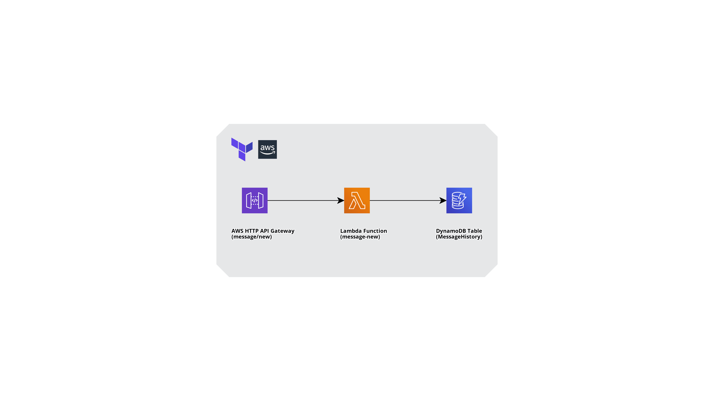

## Terraform Code Layout

A recursive directory listing to help me/us to quickly identify the key components of the IaaC used.

```bash
~/repos/woebot/IaaC/tree .
.
├── Readme.md
├── api-gateway.tf
├── aws-policies
│   └── dynamodb.json
├── code-changes
│   └── vimdiff-lambdas.png
├── diagram
│   └── message-diagram.png
├── dynamodb.tf
├── lambda
│   ├── message-new.js
│   └── message-new.zip
├── lambda.tf
├── outputs.tf
├── poc-screenshots
│   ├── ApiHTTPGateway.png
│   ├── ApiHTTPGatewayRoutes.png
│   ├── ApiHTTPGatewayStage.png
│   ├── CloudWatchApiHTTPGatewayLogs-1.png
│   ├── CloudWatchApiHTTPGatewayLogs-2.png
│   ├── CloudWatchLambdaMessageLogs-1.png
│   ├── CloudWatchLambdaMessageLogs-2.png
│   ├── CloudWatchMessageLogs.png
│   ├── MessageHistoryItems.png
│   ├── MessageNewLambdaFunction.png
│   └── MessageNewLambdaFunction2.png
├── variables.tf
└── versions.tf

5 directories, 23 files
```

## Requirements

These are the versions I have used to provision the resources on AWS.
- Terraform Version <= 1.1.8
- Terraform Providers:
  - AWS <= 4.6.0
  - Archive <= 2.2.0
  - Template <= 2.2.0

## Provisioning Resources on AWS

### Initializating the Terraform Configuration Files

The **terraform init** command is used to initialize the working directory that contains all the Terraform configuration files.

```bash
~/repos/woebot/IaaC terraform init

Initializing the backend...

Initializing provider plugins...
- Finding hashicorp/aws versions matching "~> 4.6.0"...
- Finding latest version of hashicorp/archive...
- Finding latest version of hashicorp/template...
- Installing hashicorp/aws v4.6.0...
- Installed hashicorp/aws v4.6.0 (signed by HashiCorp)
- Installing hashicorp/archive v2.2.0...
- Installed hashicorp/archive v2.2.0 (signed by HashiCorp)
- Installing hashicorp/template v2.2.0...
- Installed hashicorp/template v2.2.0 (signed by HashiCorp)

Terraform has created a lock file .terraform.lock.hcl to record the provider
selections it made above. Include this file in your version control repository
so that Terraform can guarantee to make the same selections by default when
you run "terraform init" in the future.

Terraform has been successfully initialized!

You may now begin working with Terraform. Try running "terraform plan" to see
any changes that are required for your infrastructure. All Terraform commands
should now work.

If you ever set or change modules or backend configuration for Terraform,
rerun this command to reinitialize your working directory. If you forget, other
commands will detect it and remind you to do so if necessary.
```
### Validating the Terraform Syntax

The **terraform validate** command validates the configuration files in my working directory, this runs checks that verify whether a configuration is syntactically valid and internally consistent.

```bash
~/repos/woebot/IaaC terraform validate -json
{
  "format_version": "1.0",
  "valid": true,
  "error_count": 0,
  "warning_count": 0,
  "diagnostics": []
}
```

### Creating an Execution Plan

The **terraform plan** command creates an execution plan, which lets me preview the changes that Terraform plans to make to my DevOps Challenge IaaC.

```bash

~/repos/woebot/IaaC terraform plan -out=devops-challenge.plan  

Terraform used the selected providers to generate the following execution plan. Resource actions are indicated with the following symbols:
  + create

Terraform will perform the following actions:

  # aws_apigatewayv2_api.lambda will be created
  + resource "aws_apigatewayv2_api" "lambda" {
      + api_endpoint                 = (known after apply)
      + api_key_selection_expression = "$request.header.x-api-key"
      + arn                          = (known after apply)
      + description                  = "Message HTTP API"
      + execution_arn                = (known after apply)
      + id                           = (known after apply)
      + name                         = "message"
      + protocol_type                = "HTTP"
      + route_selection_expression   = "$request.method $request.path"
      + tags_all                     = (known after apply)
    }

  # aws_apigatewayv2_integration.message will be created
  + resource "aws_apigatewayv2_integration" "message" {
      + api_id                                    = (known after apply)
      + connection_type                           = "INTERNET"
      + id                                        = (known after apply)
      + integration_method                        = "POST"
      + integration_response_selection_expression = (known after apply)
      + integration_type                          = "AWS_PROXY"
      + integration_uri                           = (known after apply)
      + payload_format_version                    = "1.0"
      + timeout_milliseconds                      = (known after apply)
    }

  # aws_apigatewayv2_route.message will be created
  + resource "aws_apigatewayv2_route" "message" {
      + api_id             = (known after apply)
      + api_key_required   = false
      + authorization_type = "NONE"
      + id                 = (known after apply)
      + route_key          = "POST /new"
      + target             = (known after apply)
    }

  # aws_apigatewayv2_stage.lambda will be created
  + resource "aws_apigatewayv2_stage" "lambda" {
      + api_id        = (known after apply)
      + arn           = (known after apply)
      + auto_deploy   = true
      + deployment_id = (known after apply)
      + execution_arn = (known after apply)
      + id            = (known after apply)
      + invoke_url    = (known after apply)
      + name          = "message"
      + tags_all      = (known after apply)

      + access_log_settings {
          + destination_arn = (known after apply)
          + format          = jsonencode(
                {
                  + httpMethod              = "$context.httpMethod"
                  + integrationErrorMessage = "$context.integrationErrorMessage"
                  + protocol                = "$context.protocol"
                  + requestId               = "$context.requestId"
                  + requestTime             = "$context.requestTime"
                  + resourcePath            = "$context.resourcePath"
                  + responseLength          = "$context.responseLength"
                  + routeKey                = "$context.routeKey"
                  + sourceIp                = "$context.identity.sourceIp"
                  + status                  = "$context.status"
                }
            )
        }
    }

  # aws_cloudwatch_log_group.api_gw will be created
  + resource "aws_cloudwatch_log_group" "api_gw" {
      + arn               = (known after apply)
      + id                = (known after apply)
      + name              = "/aws/api_gw/message"
      + retention_in_days = 1
      + tags_all          = (known after apply)
    }

  # aws_dynamodb_table.MessageHistory will be created
  + resource "aws_dynamodb_table" "MessageHistory" {
      + arn              = (known after apply)
      + billing_mode     = "PROVISIONED"
      + hash_key         = "UserId"
      + id               = (known after apply)
      + name             = "MessageHistory"
      + range_key        = "Timestamp"
      + read_capacity    = 10
      + stream_arn       = (known after apply)
      + stream_label     = (known after apply)
      + stream_view_type = (known after apply)
      + tags             = {
          + "Environment" = "Development"
          + "Name"        = "MessageHistory"
        }
      + tags_all         = {
          + "Environment" = "Development"
          + "Name"        = "MessageHistory"
        }
      + write_capacity   = 15

      + attribute {
          + name = "Timestamp"
          + type = "S"
        }
      + attribute {
          + name = "UserId"
          + type = "S"
        }

      + point_in_time_recovery {
          + enabled = (known after apply)
        }

      + server_side_encryption {
          + enabled     = (known after apply)
          + kms_key_arn = (known after apply)
        }

      + ttl {
          + attribute_name = (known after apply)
          + enabled        = (known after apply)
        }
    }

  # aws_iam_policy.MessageLambdaPolicy will be created
  + resource "aws_iam_policy" "MessageLambdaPolicy" {
      + arn         = (known after apply)
      + description = "IAM policy for Message lambda functions"
      + id          = (known after apply)
      + name        = "MessageLambdaPolicy"
      + path        = "/"
      + policy      = jsonencode(
            {
              + Statement = [
                  + {
                      + Action   = [
                          + "dynamodb:BatchGetItem",
                          + "dynamodb:GetItem",
                          + "dynamodb:Query",
                          + "dynamodb:Scan",
                          + "dynamodb:BatchWriteItem",
                          + "dynamodb:PutItem",
                          + "dynamodb:UpdateItem",
                        ]
                      + Effect   = "Allow"
                      + Resource = "arn:aws:dynamodb:eu-west-1:123456789:table/MessageHistory"
                    },
                ]
              + Version   = "2012-10-17"
            }
        )
      + policy_id   = (known after apply)
      + tags_all    = (known after apply)
    }

  # aws_iam_role.lambda_exec will be created
  + resource "aws_iam_role" "lambda_exec" {
      + arn                   = (known after apply)
      + assume_role_policy    = jsonencode(
            {
              + Statement = [
                  + {
                      + Action    = "sts:AssumeRole"
                      + Effect    = "Allow"
                      + Principal = {
                          + Service = "lambda.amazonaws.com"
                        }
                      + Sid       = ""
                    },
                ]
              + Version   = "2012-10-17"
            }
        )
      + create_date           = (known after apply)
      + force_detach_policies = false
      + id                    = (known after apply)
      + managed_policy_arns   = (known after apply)
      + max_session_duration  = 3600
      + name                  = "message-new"
      + name_prefix           = (known after apply)
      + path                  = "/"
      + tags_all              = (known after apply)
      + unique_id             = (known after apply)

      + inline_policy {
          + name   = (known after apply)
          + policy = (known after apply)
        }
    }

  # aws_iam_role_policy_attachment.MessageLambdaRolePolicy will be created
  + resource "aws_iam_role_policy_attachment" "MessageLambdaRolePolicy" {
      + id         = (known after apply)
      + policy_arn = (known after apply)
      + role       = "message-new"
    }

  # aws_iam_role_policy_attachment.lambda_policy will be created
  + resource "aws_iam_role_policy_attachment" "lambda_policy" {
      + id         = (known after apply)
      + policy_arn = "arn:aws:iam::aws:policy/service-role/AWSLambdaBasicExecutionRole"
      + role       = "message-new"
    }

  # aws_lambda_function.message will be created
  + resource "aws_lambda_function" "message" {
      + architectures                  = (known after apply)
      + arn                            = (known after apply)
      + description                    = "Takes an incoming API Gateway Event"
      + filename                       = "lambda/message-new.zip"
      + function_name                  = "message-new"
      + handler                        = "message-new.handler"
      + id                             = (known after apply)
      + invoke_arn                     = (known after apply)
      + last_modified                  = (known after apply)
      + memory_size                    = 128
      + package_type                   = "Zip"
      + publish                        = false
      + qualified_arn                  = (known after apply)
      + reserved_concurrent_executions = -1
      + role                           = (known after apply)
      + runtime                        = "nodejs12.x"
      + signing_job_arn                = (known after apply)
      + signing_profile_version_arn    = (known after apply)
      + source_code_hash               = (known after apply)
      + source_code_size               = (known after apply)
      + tags_all                       = (known after apply)
      + timeout                        = 3
      + version                        = (known after apply)

      + tracing_config {
          + mode = (known after apply)
        }
    }

  # aws_lambda_permission.api_gw will be created
  + resource "aws_lambda_permission" "api_gw" {
      + action        = "lambda:InvokeFunction"
      + function_name = "message-new"
      + id            = (known after apply)
      + principal     = "apigateway.amazonaws.com"
      + source_arn    = (known after apply)
      + statement_id  = "AllowExecutionFromAPIGateway"
    }

Plan: 12 to add, 0 to change, 0 to destroy.

Changes to Outputs:
  + base_url       = (known after apply)
  + dynamodb_table = (known after apply)
  + function_name  = "message-new"

Saved the plan to: devops-challenge.plan

To perform exactly these actions, run the following command to apply:
    terraform apply "devops-challenge.plan"
```

### Applying the Terraform Configuration Plan

The **terraform apply** command executes the actions proposed in the **devops-challenge.plan** plan

```bash
 ~/repos/woebot/IaaC terraform apply devops-challenge.plan

aws_iam_policy.MessageLambdaPolicy: Creating...
aws_iam_role.lambda_exec: Creating...
aws_apigatewayv2_api.lambda: Creating...
aws_dynamodb_table.MessageHistory: Creating...
aws_apigatewayv2_api.lambda: Creation complete after 1s [id=b53ouobg9f]
aws_cloudwatch_log_group.api_gw: Creating...
aws_iam_policy.MessageLambdaPolicy: Creation complete after 1s [id=arn:aws:iam::123456789:policy/MessageLambdaPolicy]
aws_cloudwatch_log_group.api_gw: Creation complete after 0s [id=/aws/api_gw/message]
aws_apigatewayv2_stage.lambda: Creating...
aws_iam_role.lambda_exec: Creation complete after 1s [id=message-new]
aws_iam_role_policy_attachment.MessageLambdaRolePolicy: Creating...
aws_iam_role_policy_attachment.lambda_policy: Creating...
aws_lambda_function.message: Creating...
aws_iam_role_policy_attachment.MessageLambdaRolePolicy: Creation complete after 1s [id=message-new-20220613095825619300000002]
aws_iam_role_policy_attachment.lambda_policy: Creation complete after 1s [id=message-new-20220613095825615800000001]
aws_apigatewayv2_stage.lambda: Creation complete after 1s [id=message]
aws_dynamodb_table.MessageHistory: Still creating... [10s elapsed]
aws_lambda_function.message: Still creating... [10s elapsed]
aws_dynamodb_table.MessageHistory: Creation complete after 13s [id=MessageHistory]
aws_lambda_function.message: Still creating... [20s elapsed]
aws_lambda_function.message: Creation complete after 22s [id=message-new]
aws_lambda_permission.api_gw: Creating...
aws_apigatewayv2_integration.message: Creating...
aws_lambda_permission.api_gw: Creation complete after 0s [id=AllowExecutionFromAPIGateway]
aws_apigatewayv2_integration.message: Creation complete after 0s [id=377c1fr]
aws_apigatewayv2_route.message: Creating...
aws_apigatewayv2_route.message: Creation complete after 0s [id=44490k3]

Apply complete! Resources: 12 added, 0 changed, 0 destroyed.

Outputs:

base_url = "https://b53ouobg9f.execute-api.eu-west-1.amazonaws.com/message"
dynamodb_table = "MessageHistory"
function_name = "message-new"
```

## Testing the HTTP API Gateway

### 

The following curl commands, make two http requests to the **base_url**, this is the HTTP API Gateway endpoint previously provisioned through Terraform which takes an incoming event, extracts the user id, message and writes them to the MessageHistory DynamoDB Table along with the timestamp.

```bash
~/repos/woebot/IaaC curl --header "Content-Type: application/json" --request POST --data '{"UserId":"1","MessageText":"Hello World"}' $(terraform output -raw base_url)/new
Staus Code: 200, item successfully put, UserId:1%
```

```bash
curl --header "Content-Type: application/json" --request POST --data '{"UserId":"2","MessageText":"Morning fancy a coffee Jordi"}' $(terraform output -raw base_url)/new
Staus Code: 200, item successfully put, UserId:2%
```

## PoC Screenshots

The following images are the screenshots I took of the resources provisioned on AWS through Terraform running the steps stated above

### Lambda Function

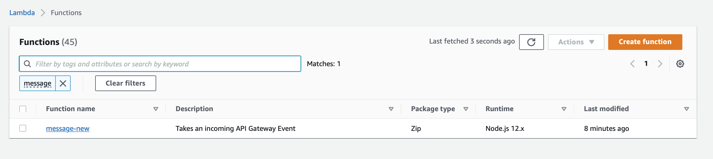
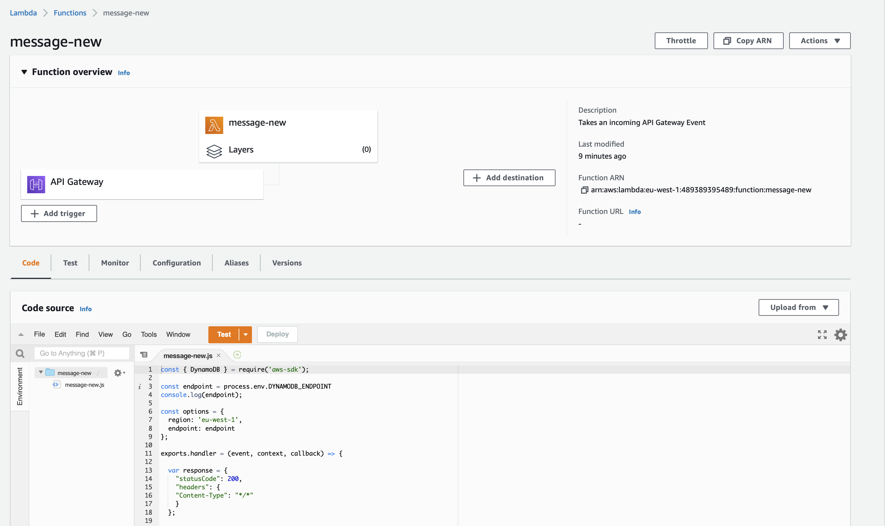

### API HTTP Gateway

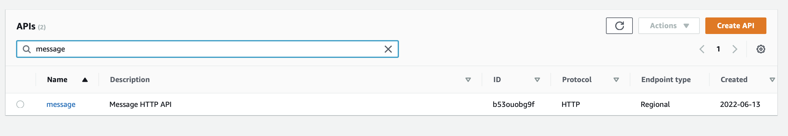
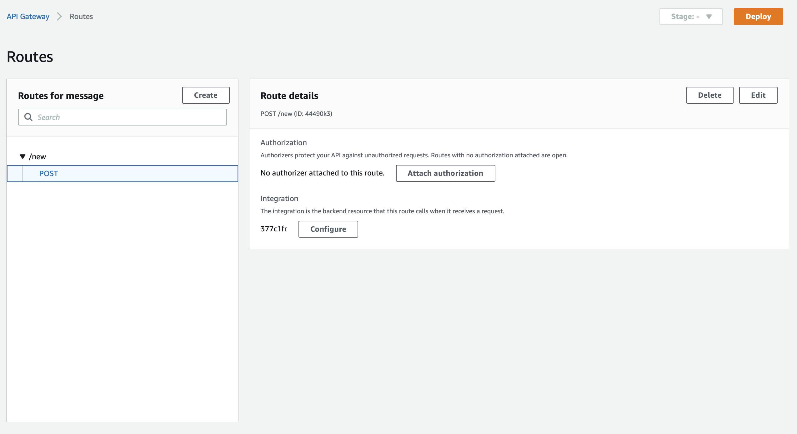
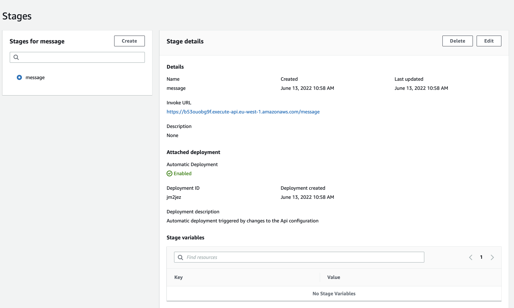

### CloudWatch Logs

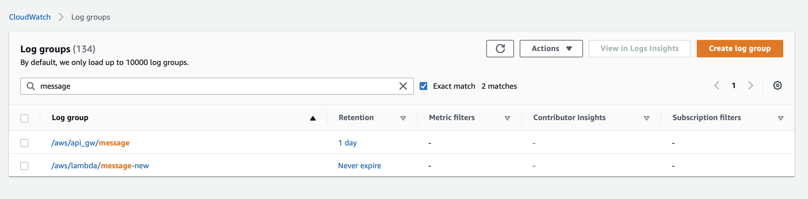
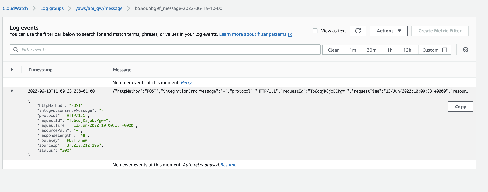
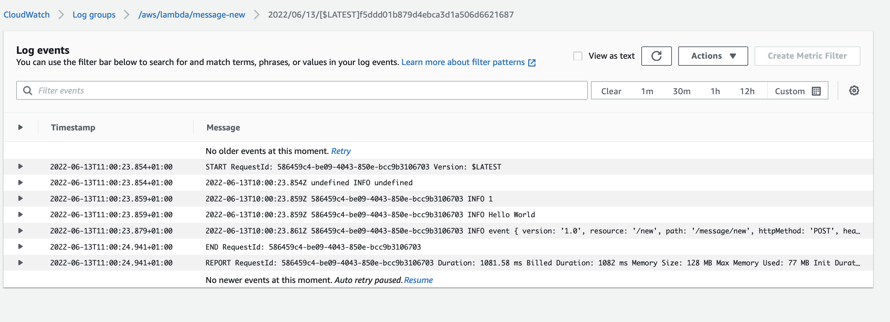
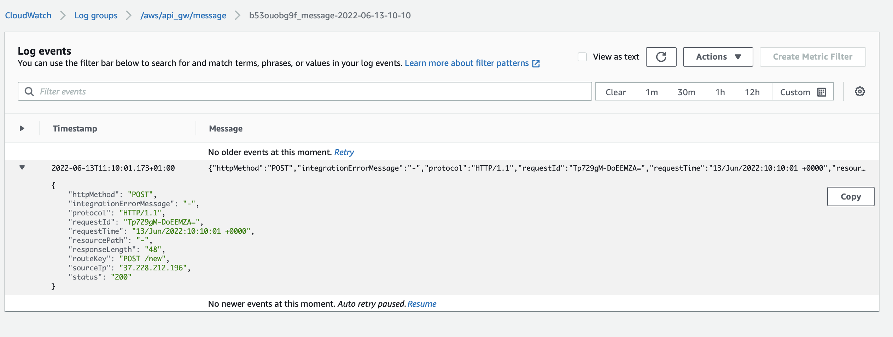
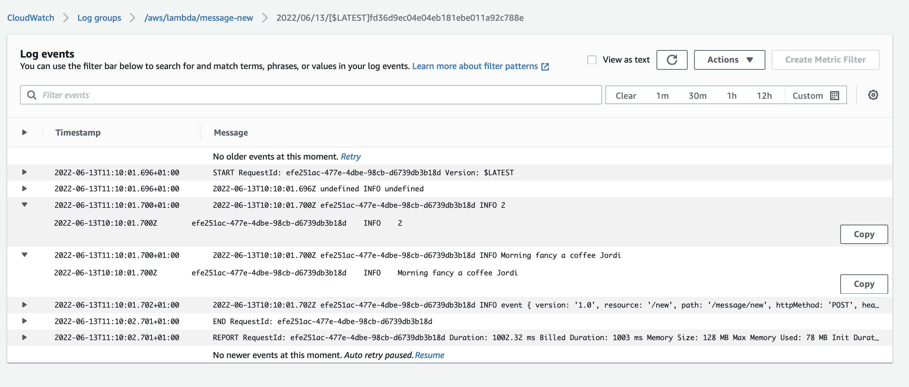

### DynamoDB Items

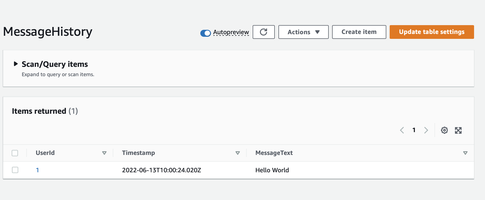

## Destroying the Terraform Configuration Files

The **terraform destroy** command is the best approach to destroy all the remote objects managed by this particualar Terraform configuration, let's first create a plan to preview what are the actions Terraform will perform.

```bash
~/repos/woebot/IaaC terraform plan -out=destroy-devops-challenge.plan -destroy

aws_iam_policy.MessageLambdaPolicy: Refreshing state... [id=arn:aws:iam::123456789:policy/MessageLambdaPolicy]
aws_iam_role.lambda_exec: Refreshing state... [id=message-new]
aws_apigatewayv2_api.lambda: Refreshing state... [id=b53ouobg9f]
aws_dynamodb_table.MessageHistory: Refreshing state... [id=MessageHistory]
aws_cloudwatch_log_group.api_gw: Refreshing state... [id=/aws/api_gw/message]
aws_apigatewayv2_stage.lambda: Refreshing state... [id=message]
aws_iam_role_policy_attachment.MessageLambdaRolePolicy: Refreshing state... [id=message-new-20220613095825619300000002]
aws_iam_role_policy_attachment.lambda_policy: Refreshing state... [id=message-new-20220613095825615800000001]
aws_lambda_function.message: Refreshing state... [id=message-new]
aws_lambda_permission.api_gw: Refreshing state... [id=AllowExecutionFromAPIGateway]
aws_apigatewayv2_integration.message: Refreshing state... [id=377c1fr]
aws_apigatewayv2_route.message: Refreshing state... [id=44490k3]

Terraform used the selected providers to generate the following execution plan. Resource actions are indicated with the following symbols:
  - destroy

Terraform will perform the following actions:

  # aws_apigatewayv2_api.lambda will be destroyed
  - resource "aws_apigatewayv2_api" "lambda" {
      - api_endpoint                 = "https://b53ouobg9f.execute-api.eu-west-1.amazonaws.com" -> null
      - api_key_selection_expression = "$request.header.x-api-key" -> null
      - arn                          = "arn:aws:apigateway:eu-west-1::/apis/b53ouobg9f" -> null
      - description                  = "Message HTTP API" -> null
      - disable_execute_api_endpoint = false -> null
      - execution_arn                = "arn:aws:execute-api:eu-west-1:123456789:b53ouobg9f" -> null
      - id                           = "b53ouobg9f" -> null
      - name                         = "message" -> null
      - protocol_type                = "HTTP" -> null
      - route_selection_expression   = "$request.method $request.path" -> null
      - tags                         = {} -> null
      - tags_all                     = {} -> null
    }

  # aws_apigatewayv2_integration.message will be destroyed
  - resource "aws_apigatewayv2_integration" "message" {
      - api_id                 = "b53ouobg9f" -> null
      - connection_type        = "INTERNET" -> null
      - id                     = "377c1fr" -> null
      - integration_method     = "POST" -> null
      - integration_type       = "AWS_PROXY" -> null
      - integration_uri        = "arn:aws:apigateway:eu-west-1:lambda:path/2015-03-31/functions/arn:aws:lambda:eu-west-1:123456789:function:message-new/invocations" -> null
      - payload_format_version = "1.0" -> null
      - request_parameters     = {} -> null
      - request_templates      = {} -> null
      - timeout_milliseconds   = 30000 -> null
    }

  # aws_apigatewayv2_route.message will be destroyed
  - resource "aws_apigatewayv2_route" "message" {
      - api_id               = "b53ouobg9f" -> null
      - api_key_required     = false -> null
      - authorization_scopes = [] -> null
      - authorization_type   = "NONE" -> null
      - id                   = "44490k3" -> null
      - request_models       = {} -> null
      - route_key            = "POST /new" -> null
      - target               = "integrations/377c1fr" -> null
    }

  # aws_apigatewayv2_stage.lambda will be destroyed
  - resource "aws_apigatewayv2_stage" "lambda" {
      - api_id          = "b53ouobg9f" -> null
      - arn             = "arn:aws:apigateway:eu-west-1::/apis/b53ouobg9f/stages/message" -> null
      - auto_deploy     = true -> null
      - deployment_id   = "jm2jez" -> null
      - execution_arn   = "arn:aws:execute-api:eu-west-1:123456789:b53ouobg9f/message" -> null
      - id              = "message" -> null
      - invoke_url      = "https://b53ouobg9f.execute-api.eu-west-1.amazonaws.com/message" -> null
      - name            = "message" -> null
      - stage_variables = {} -> null
      - tags            = {} -> null
      - tags_all        = {} -> null

      - access_log_settings {
          - destination_arn = "arn:aws:logs:eu-west-1:123456789:log-group:/aws/api_gw/message" -> null
          - format          = jsonencode(
                {
                  - httpMethod              = "$context.httpMethod"
                  - integrationErrorMessage = "$context.integrationErrorMessage"
                  - protocol                = "$context.protocol"
                  - requestId               = "$context.requestId"
                  - requestTime             = "$context.requestTime"
                  - resourcePath            = "$context.resourcePath"
                  - responseLength          = "$context.responseLength"
                  - routeKey                = "$context.routeKey"
                  - sourceIp                = "$context.identity.sourceIp"
                  - status                  = "$context.status"
                }
            ) -> null
        }

      - default_route_settings {
          - data_trace_enabled       = false -> null
          - detailed_metrics_enabled = false -> null
          - throttling_burst_limit   = 0 -> null
          - throttling_rate_limit    = 0 -> null
        }
    }

  # aws_cloudwatch_log_group.api_gw will be destroyed
  - resource "aws_cloudwatch_log_group" "api_gw" {
      - arn               = "arn:aws:logs:eu-west-1:123456789:log-group:/aws/api_gw/message" -> null
      - id                = "/aws/api_gw/message" -> null
      - name              = "/aws/api_gw/message" -> null
      - retention_in_days = 1 -> null
      - tags              = {} -> null
      - tags_all          = {} -> null
    }

  # aws_dynamodb_table.MessageHistory will be destroyed
  - resource "aws_dynamodb_table" "MessageHistory" {
      - arn            = "arn:aws:dynamodb:eu-west-1:123456789:table/MessageHistory" -> null
      - billing_mode   = "PROVISIONED" -> null
      - hash_key       = "UserId" -> null
      - id             = "MessageHistory" -> null
      - name           = "MessageHistory" -> null
      - range_key      = "Timestamp" -> null
      - read_capacity  = 10 -> null
      - stream_enabled = false -> null
      - tags           = {
          - "Environment" = "Development"
          - "Name"        = "MessageHistory"
        } -> null
      - tags_all       = {
          - "Environment" = "Development"
          - "Name"        = "MessageHistory"
        } -> null
      - write_capacity = 15 -> null

      - attribute {
          - name = "Timestamp" -> null
          - type = "S" -> null
        }
      - attribute {
          - name = "UserId" -> null
          - type = "S" -> null
        }

      - point_in_time_recovery {
          - enabled = false -> null
        }

      - ttl {
          - enabled = false -> null
        }
    }

  # aws_iam_policy.MessageLambdaPolicy will be destroyed
  - resource "aws_iam_policy" "MessageLambdaPolicy" {
      - arn         = "arn:aws:iam::123456789:policy/MessageLambdaPolicy" -> null
      - description = "IAM policy for Message lambda functions" -> null
      - id          = "arn:aws:iam::123456789:policy/MessageLambdaPolicy" -> null
      - name        = "MessageLambdaPolicy" -> null
      - path        = "/" -> null
      - policy      = jsonencode(
            {
              - Statement = [
                  - {
                      - Action   = [
                          - "dynamodb:BatchGetItem",
                          - "dynamodb:GetItem",
                          - "dynamodb:Query",
                          - "dynamodb:Scan",
                          - "dynamodb:BatchWriteItem",
                          - "dynamodb:PutItem",
                          - "dynamodb:UpdateItem",
                        ]
                      - Effect   = "Allow"
                      - Resource = "arn:aws:dynamodb:eu-west-1:123456789:table/MessageHistory"
                    },
                ]
              - Version   = "2012-10-17"
            }
        ) -> null
      - policy_id   = "ANPAXD4PBRYQ4YNMTZKF7" -> null
      - tags        = {} -> null
      - tags_all    = {} -> null
    }

  # aws_iam_role.lambda_exec will be destroyed
  - resource "aws_iam_role" "lambda_exec" {
      - arn                   = "arn:aws:iam::123456789:role/message-new" -> null
      - assume_role_policy    = jsonencode(
            {
              - Statement = [
                  - {
                      - Action    = "sts:AssumeRole"
                      - Effect    = "Allow"
                      - Principal = {
                          - Service = "lambda.amazonaws.com"
                        }
                      - Sid       = ""
                    },
                ]
              - Version   = "2012-10-17"
            }
        ) -> null
      - create_date           = "2022-06-13T09:58:26Z" -> null
      - force_detach_policies = false -> null
      - id                    = "message-new" -> null
      - managed_policy_arns   = [
          - "arn:aws:iam::123456789:policy/MessageLambdaPolicy",
          - "arn:aws:iam::aws:policy/service-role/AWSLambdaBasicExecutionRole",
        ] -> null
      - max_session_duration  = 3600 -> null
      - name                  = "message-new" -> null
      - path                  = "/" -> null
      - tags                  = {} -> null
      - tags_all              = {} -> null
      - unique_id             = "AROAXD4PBRYQZTDGIKKRB" -> null

      - inline_policy {}
    }

  # aws_iam_role_policy_attachment.MessageLambdaRolePolicy will be destroyed
  - resource "aws_iam_role_policy_attachment" "MessageLambdaRolePolicy" {
      - id         = "message-new-20220613095825619300000002" -> null
      - policy_arn = "arn:aws:iam::123456789:policy/MessageLambdaPolicy" -> null
      - role       = "message-new" -> null
    }

  # aws_iam_role_policy_attachment.lambda_policy will be destroyed
  - resource "aws_iam_role_policy_attachment" "lambda_policy" {
      - id         = "message-new-20220613095825615800000001" -> null
      - policy_arn = "arn:aws:iam::aws:policy/service-role/AWSLambdaBasicExecutionRole" -> null
      - role       = "message-new" -> null
    }

  # aws_lambda_function.message will be destroyed
  - resource "aws_lambda_function" "message" {
      - architectures                  = [
          - "x86_64",
        ] -> null
      - arn                            = "arn:aws:lambda:eu-west-1:123456789:function:message-new" -> null
      - description                    = "Takes an incoming API Gateway Event" -> null
      - filename                       = "lambda/message-new.zip" -> null
      - function_name                  = "message-new" -> null
      - handler                        = "message-new.handler" -> null
      - id                             = "message-new" -> null
      - invoke_arn                     = "arn:aws:apigateway:eu-west-1:lambda:path/2015-03-31/functions/arn:aws:lambda:eu-west-1:123456789:function:message-new/invocations" -> null
      - last_modified                  = "2022-06-13T09:58:48.947+0000" -> null
      - layers                         = [] -> null
      - memory_size                    = 128 -> null
      - package_type                   = "Zip" -> null
      - publish                        = false -> null
      - qualified_arn                  = "arn:aws:lambda:eu-west-1:123456789:function:message-new:$LATEST" -> null
      - reserved_concurrent_executions = -1 -> null
      - role                           = "arn:aws:iam::123456789:role/message-new" -> null
      - runtime                        = "nodejs12.x" -> null
      - source_code_hash               = "MPJLQdN8dJpST4uqrvV+SQ4YmmZNSzWg89UrrVj4Nbo=" -> null
      - source_code_size               = 696 -> null
      - tags                           = {} -> null
      - tags_all                       = {} -> null
      - timeout                        = 3 -> null
      - version                        = "$LATEST" -> null

      - tracing_config {
          - mode = "PassThrough" -> null
        }
    }

  # aws_lambda_permission.api_gw will be destroyed
  - resource "aws_lambda_permission" "api_gw" {
      - action        = "lambda:InvokeFunction" -> null
      - function_name = "message-new" -> null
      - id            = "AllowExecutionFromAPIGateway" -> null
      - principal     = "apigateway.amazonaws.com" -> null
      - source_arn    = "arn:aws:execute-api:eu-west-1:123456789:b53ouobg9f/*/*" -> null
      - statement_id  = "AllowExecutionFromAPIGateway" -> null
    }

Plan: 0 to add, 0 to change, 12 to destroy.

Changes to Outputs:
  - base_url       = "https://b53ouobg9f.execute-api.eu-west-1.amazonaws.com/message" -> null
  - dynamodb_table = "MessageHistory" -> null
  - function_name  = "message-new" -> null

Saved the plan to: destroy-devops-challenge.plan

To perform exactly these actions, run the following command to apply:
    terraform apply "destroy-devops-challenge.plan"
```

After carefully reviewing what the actions Terraform will perform, let's apply them by:

```bash
~/repos/woebot/IaaC terraform apply "destroy-devops-challenge.plan"

aws_iam_role_policy_attachment.MessageLambdaRolePolicy: Destroying... [id=message-new-20220613095825619300000002]
aws_iam_role_policy_attachment.lambda_policy: Destroying... [id=message-new-20220613095825615800000001]
aws_lambda_permission.api_gw: Destroying... [id=AllowExecutionFromAPIGateway]
aws_apigatewayv2_route.message: Destroying... [id=44490k3]
aws_apigatewayv2_stage.lambda: Destroying... [id=message]
aws_dynamodb_table.MessageHistory: Destroying... [id=MessageHistory]
aws_lambda_permission.api_gw: Destruction complete after 0s
aws_apigatewayv2_route.message: Destruction complete after 0s
aws_apigatewayv2_integration.message: Destroying... [id=377c1fr]
aws_apigatewayv2_integration.message: Destruction complete after 0s
aws_apigatewayv2_stage.lambda: Destruction complete after 0s
aws_cloudwatch_log_group.api_gw: Destroying... [id=/aws/api_gw/message]
aws_lambda_function.message: Destroying... [id=message-new]
aws_iam_role_policy_attachment.lambda_policy: Destruction complete after 0s
aws_iam_role_policy_attachment.MessageLambdaRolePolicy: Destruction complete after 0s
aws_iam_policy.MessageLambdaPolicy: Destroying... [id=arn:aws:iam::123456789:policy/MessageLambdaPolicy]
aws_lambda_function.message: Destruction complete after 0s
aws_iam_role.lambda_exec: Destroying... [id=message-new]
aws_cloudwatch_log_group.api_gw: Destruction complete after 0s
aws_apigatewayv2_api.lambda: Destroying... [id=b53ouobg9f]
aws_iam_policy.MessageLambdaPolicy: Destruction complete after 1s
aws_iam_role.lambda_exec: Destruction complete after 1s
aws_apigatewayv2_api.lambda: Destruction complete after 1s
aws_dynamodb_table.MessageHistory: Destruction complete after 3s

Apply complete! Resources: 0 added, 0 changed, 12 destroyed.
```

## External Sources and Documentation

- https://docs.aws.amazon.com/apigateway/latest/developerguide/http-api.html
- https://learn.hashicorp.com/tutorials/terraform/lambda-api-gateway
- https://docs.aws.amazon.com/lambda/latest/dg/nodejs-handler.html

